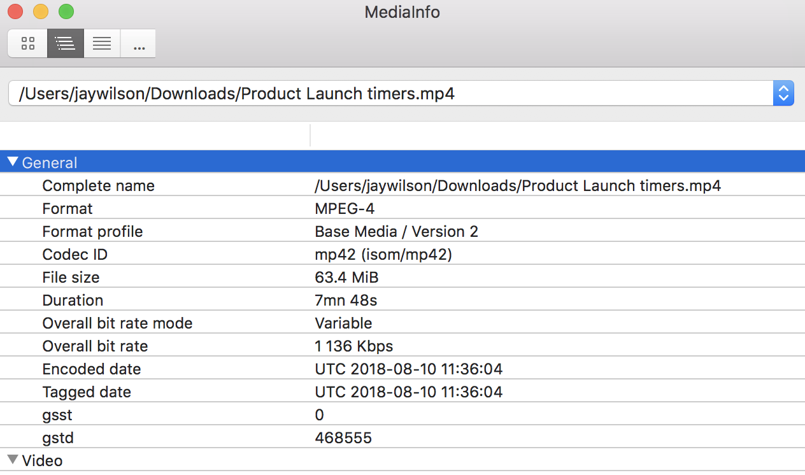
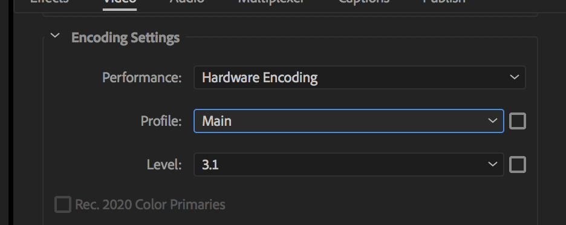

# Settings

## VSL

1. Find a sample video
2. Open video with **media info.app**
   1. Change to **tree view**

- General
  - Overall bit rate (1000 kbps in media info = 1mb in premier)
  - File size  (this will be your export size goal)
- Video
  - Format (export type)
  - Format Profile
  - Bit Rate
  - Maximum Bit Rate
- Audio
  - Format
  - Bit Rate
  - Channels
  - Sampling Rate

## Premier

`Cmd+m` to export
Check general info after exporting to see if on point

Set settings
Check file size
export