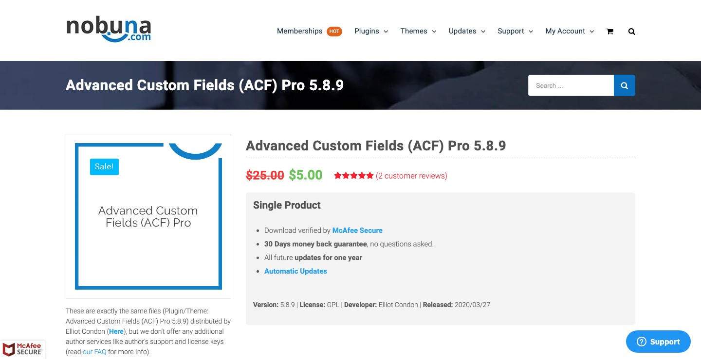

This **only** works for plugins found on https://nobuna.com

You must have a **Nobuna account** and be logged in.

___
To download a plugin you must replace 2 variables in the url below:
```
http://nobuna.com/wp-admin/admin-ajax.php?action=nbdownload&pid=1111&ver=1.0.0
```
Replace:
-  `pid=1111` with a **product id**. *Note some plugin `pid` may not always be 4 digits long.*
-  `ver=1.0.0` with **version number**. *Note some plugin `ver` may not always be 2 decimals deep.*

To begin select a plugin from the nobuna library and click through to it's **product page**. (Seen below)



To find the **version id**:

- The current **version number** of a plugin can be **found** in the **heading** and the **bottom left corner of grey box**. (in the **example** product page image above the version is **5.8.9**)
- Previous version numbers can be found under the **Older Version** tab further down the page.
- Update the **url** after `&ver=` with the **version number**:
```
http://nobuna.com/wp-admin/admin-ajax.php?action=nbdownload&pid=1111&ver=5.8.9
```
To find the **product id**:
- On the plugin's **product page** right click and press `inpsect`
- Search `shortlink`. The tag below should appear:
```
<link rel="shortlink" href="https://www.nobuna.com/?p=XXXX">
```
- The digits after `&pid=` represented by the `XXXX` will be the **product id**.
- Update the **url** after `&pid=` with the **product id**:
```
http://nobuna.com/wp-admin/admin-ajax.php?action=nbdownload&pid=3587&ver=5.8.9
```

Paste the url into a **browser** and press `enter`. The plugin will then automatically download.
